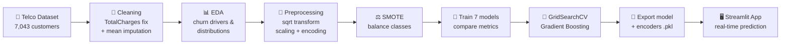
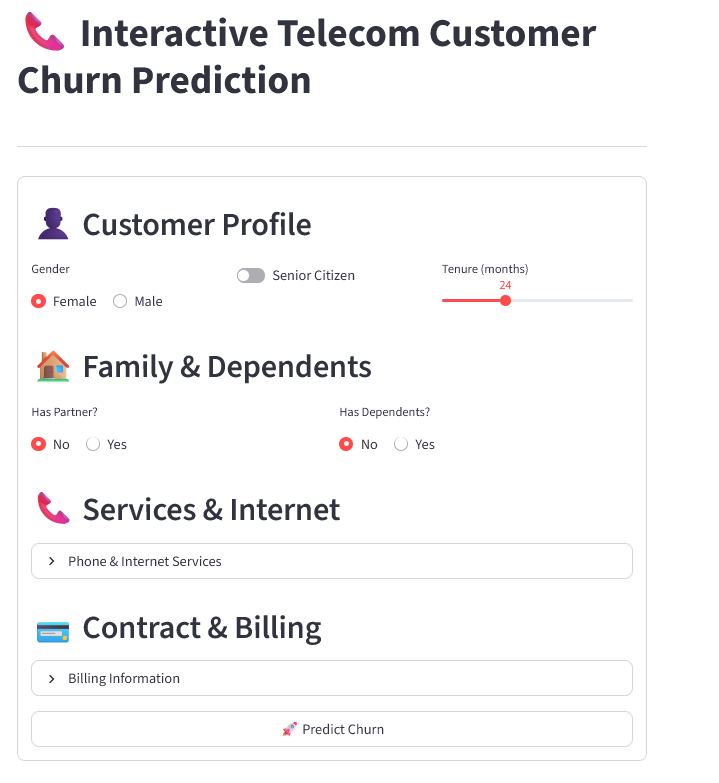
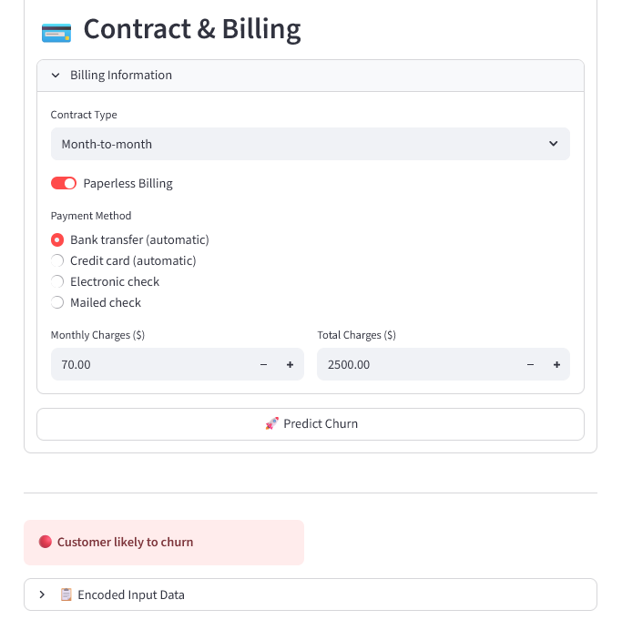

# 📞 Telco Customer Churn Prediction

<div align="center">


**An end-to-end machine learning project that predicts telecom customer churn — from EDA to a deployed interactive web app.**

[🌐 Live Demo](https://telco-customer-churn-prediction-v.streamlit.app/) · [📓 Notebook](./notebook.ipynb) · [🚀 Quick Start](#%EF%B8%8F-installation)

</div>

---

## 🔍 Project Overview

Customer churn is a major challenge for telecom companies, directly impacting revenue and growth. This project analyzes the **IBM Telco Customer Churn dataset** (7,043 customers, 19 features) to predict which customers are likely to leave, and wraps the best model in a **Streamlit web app** for real-time predictions.

**What's inside:**

- 📊 **EDA & Cleaning** — distributions, churn drivers, fixing `TotalCharges` (stored as text with blanks → numeric with mean imputation)
- 🔧 **Feature Engineering** — square-root transform to reduce skew, standard scaling, label encoding (encoders saved for reuse)
- ⚖️ **Class Imbalance Handling** — SMOTE oversampling on the training set
- 🤖 **7 Models Benchmarked** — Logistic Regression, Decision Tree, Random Forest, Gradient Boosting, XGBoost, KNN, SVM
- 🎯 **Hyperparameter Tuning** — GridSearchCV (5-fold, F1-optimized) on the winning Gradient Boosting model
- 🖥️ **Interactive App** — dropdowns, sliders, and toggles for customer attributes with instant churn predictions

---

## 🔬 ML Pipeline


```mermaid
flowchart LR
    A[📂 Telco Dataset<br/>7,043 customers] --> B[🧹 Cleaning<br/>TotalCharges fix<br/>+ mean imputation]
    B --> C[📊 EDA<br/>churn drivers &<br/>distributions]
    C --> D[🔧 Preprocessing<br/>sqrt transform<br/>scaling + encoding]
    D --> E[⚖️ SMOTE<br/>balance classes]
    E --> F[🤖 Train 7 models<br/>compare metrics]
    F --> G[🎯 GridSearchCV<br/>Gradient Boosting]
    G --> H[💾 Export model<br/>+ encoders .pkl]
    H --> I[🖥️ Streamlit App<br/>real-time prediction]
```

---

## 📈 Model Comparison

All models were evaluated on a held-out 20% test set (stratified split), with SMOTE applied only to training data.

| Model | Accuracy | Precision (Churn) | Recall (Churn) | F1 (Churn) | Remarks |
|---|:---:|:---:|:---:|:---:|---|
| Logistic Regression | 0.71 | 0.46 | 0.56 | 0.51 | Underfits; struggles with minority class |
| Decision Tree | 0.78 | 0.58 | 0.63 | 0.60 | Better recall; some overfitting |
| Random Forest | 0.78 | 0.58 | 0.63 | 0.60 | Robust; slightly better generalization |
| **Gradient Boosting** ⭐ | **0.77** | **0.55** | **0.76** | **0.64** | **Best precision/recall balance** |
| XGBoost | 0.78 | 0.57 | 0.69 | 0.62 | Solid, similar to Gradient Boosting |
| KNN | 0.72 | 0.48 | 0.70 | 0.57 | High recall, low precision |
| SVM | 0.77 | 0.55 | 0.76 | 0.64 | Matches Gradient Boosting |

**F1-Score (Churn class) at a glance:**

```
Logistic Regression  ██████████████░░░░░░  0.51
Decision Tree        ████████████████░░░░  0.60
Random Forest        ████████████████░░░░  0.60
Gradient Boosting ⭐ ██████████████████░░  0.64
XGBoost              █████████████████░░░  0.62
KNN                  ███████████████░░░░░  0.57
SVM                  ██████████████████░░  0.64
```

### 🏆 Final Model — Tuned Gradient Boosting

| | |
|---|---|
| **ROC AUC** | **0.84** |
| **Test Accuracy** | 0.78 |
| **5-fold CV F1** | 0.826 |
| **Best Params** | `learning_rate=0.05`, `max_depth=7`, `n_estimators=200`, `subsample=0.7`, `min_samples_split=2` |

> An AUC of 0.84 means the model correctly ranks a random churner above a random non-churner ~84% of the time — significantly better than the 0.5 random baseline. Recall was prioritized so fewer at-risk customers slip through undetected.

---

## 🖼 App Preview

| Customer Input Form | Prediction Result |
|:---:|:---:|
|  |  |

---

## ⚡ Features

- **Interactive Input Widgets** — dropdowns, sliders, toggles, and radio buttons for all 19 customer attributes
- **Real-time Prediction** — instant churn verdict on submit 🟢/🔴
- **Grouped Sections** — profile, family, services, and billing organized in clean expandable panels
- **Transparent Inputs** — view the encoded feature vector fed to the model
- **Deployed on Streamlit Cloud** — no setup needed to try it

---

## 📁 Project Structure

```
telco-customer-churn-prediction/
├── app.py                          # Streamlit web app
├── notebook.ipynb                  # EDA → preprocessing → model training
├── requirements.txt                # Dependencies
├── datasets/
│   └── WA_Fn-UseC_-Telco-Customer-Churn.csv
└── bin/
    ├── gradient_boosting_model.pkl # Trained final model
    ├── label_encoders.pkl          # Saved categorical encoders
    ├── s1.png                      # App screenshots
    └── s2.png
```

---

## 🛠️ Installation

1. **Clone the repo**
```bash
git clone https://github.com/vishalgupta-git/telco-customer-churn-prediction.git
cd telco-customer-churn-prediction
```

2. **Install dependencies**
```bash
pip install -r requirements.txt
```

3. **Run the Streamlit app**
```bash
streamlit run app.py
```

4. Open your browser at `http://localhost:8501`.

To explore the full analysis and retrain the model, open [notebook.ipynb](./notebook.ipynb).

---

## 🧰 Tech Stack

| Category | Tools |
|---|---|
| **Language** | Python |
| **Data & EDA** | Pandas, NumPy, Matplotlib, Seaborn |
| **Modeling** | scikit-learn, XGBoost, imbalanced-learn (SMOTE) |
| **App & Deployment** | Streamlit, Streamlit Cloud |
| **Persistence** | joblib |

---

## 👤 Author

**Vishal Gupta** — Data Science Enthusiast & ML Developer

[](https://github.com/vishalgupta-git)

---

<div align="center">

⭐ *If you found this project useful, consider giving it a star!*

</div>
