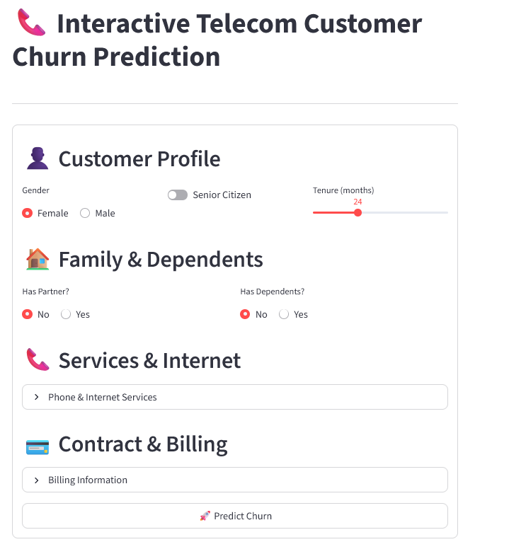

# 📞 Telecom Customer Churn Prediction

A **Streamlit web app** that predicts telecom customer churn using machine learning. Users can input customer details and get real-time predictions.

---

## 🔍 Project Overview

Customer churn is a major challenge for telecom companies, impacting revenue and growth. This project predicts which customers are likely to leave using historical data and machine learning.  

Key aspects of the project:  

- **Data Exploration & Cleaning:** Performed exploratory data analysis (EDA) to understand trends, distributions, and relationships. Handled missing values and inconsistent entries.  
- **Model Testing:** Evaluated multiple machine learning models to identify the most accurate for churn prediction.  
- **Interactive UI:** Developed a **Streamlit interface** with dropdowns, sliders, and radio buttons for user-friendly data input.  
- **Label Encoding:** Converted categorical features to numeric form for machine learning models.  

Goal: Provide a practical tool to help telecom companies identify potential churners and implement retention strategies.

---

## ⚡ Features

- **Interactive Input Widgets:** Use dropdowns, sliders, and radio buttons for each customer attribute.  
- **Real-time Prediction:** Instantly predict churn based on user inputs.  
- **Multiple Models Tested:** Backend supports different ML models (Gradient Boosting, Random Forest, etc.) for robust predictions.  
- **User-friendly UI:** Clean layout and responsive design for easy navigation.  
- **Visual Feedback:** Screenshots show input and prediction flow clearly.  

---

## 🖼 Screenshots

  
  

---

## 🌐 Live Demo

Access the app online on Streamlit Cloud: [Churn Prediction App](https://telco-customer-churn-prediction-v.streamlit.app/)

---

## 🛠️ Installation

1. Clone the repo:
```bash
git clone https://github.com/yourusername/telecom-churn-app.git
cd telecom-churn-app
```

2. Install dependencies:
```bash
pip install -r requirements.txt
```

3. Run the Streamlit app:
```bash
streamlit run app.py
```

4. Open your browser at http://localhost:8501 to access the app.

## 👤 Author

**Vishal Gupta** – Data Science Enthusiast & ML Developer  

- [GitHub](https://github.com/vishalgupta-git) 
